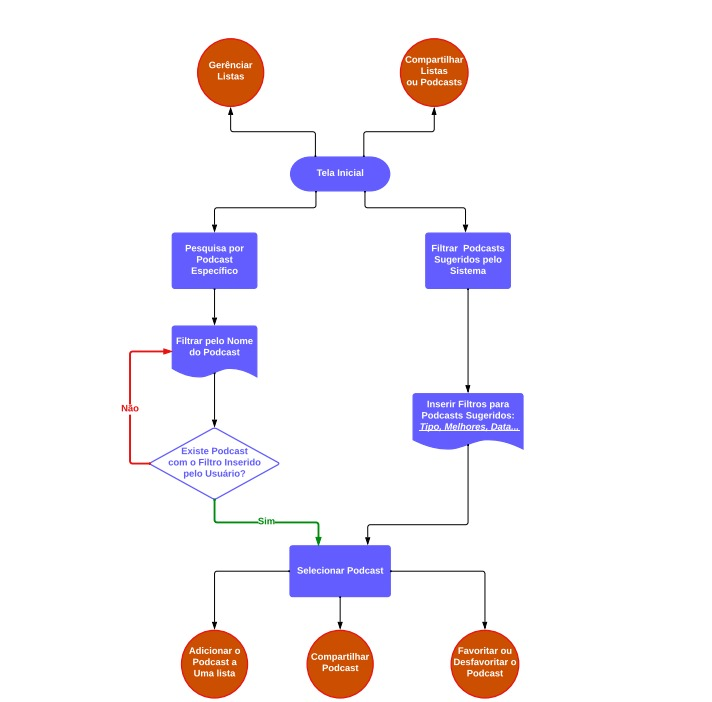
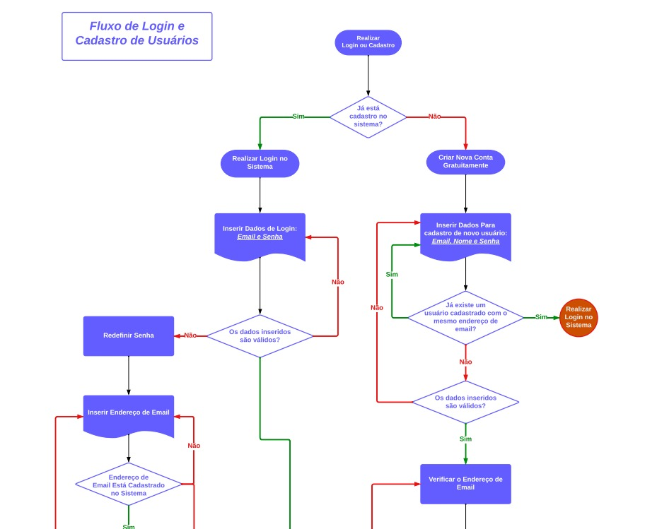
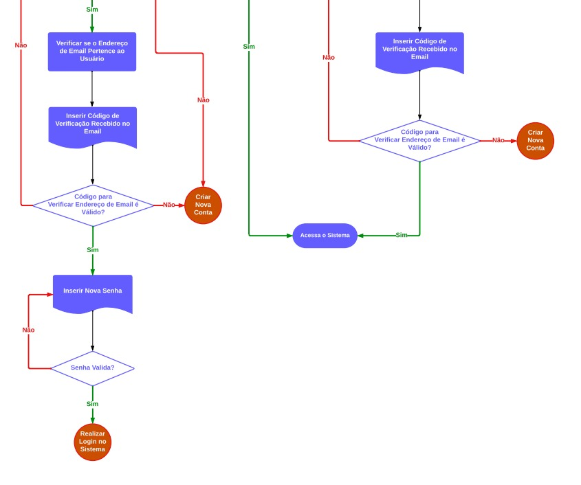
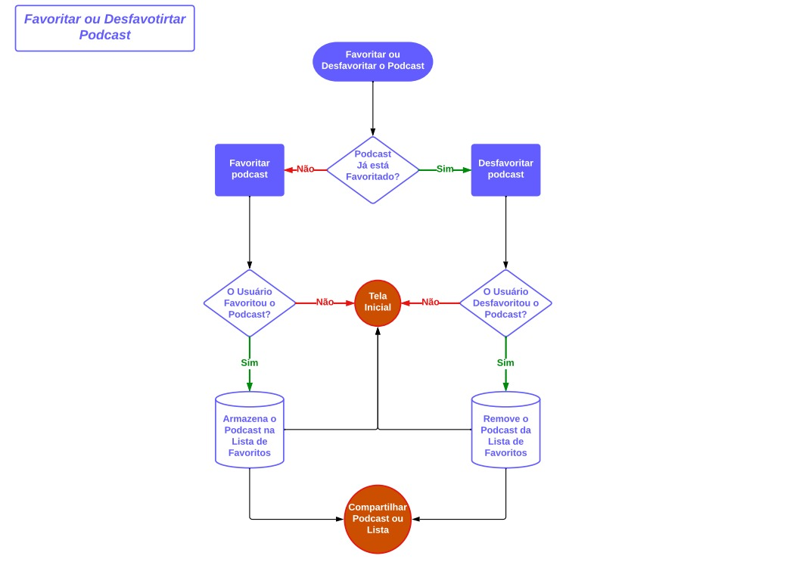
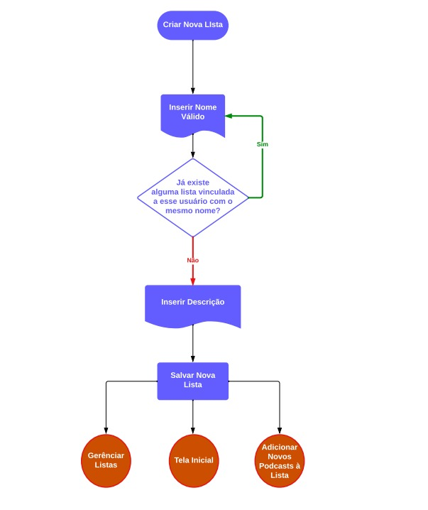
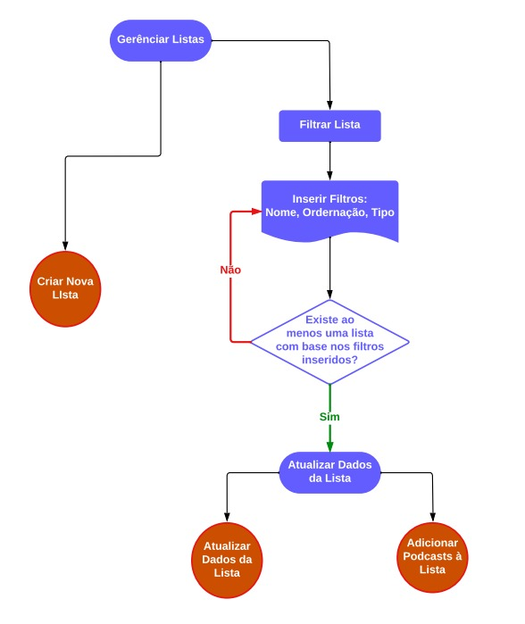
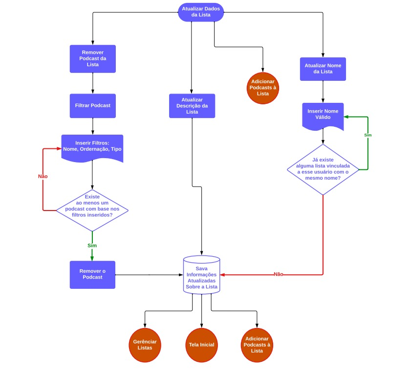
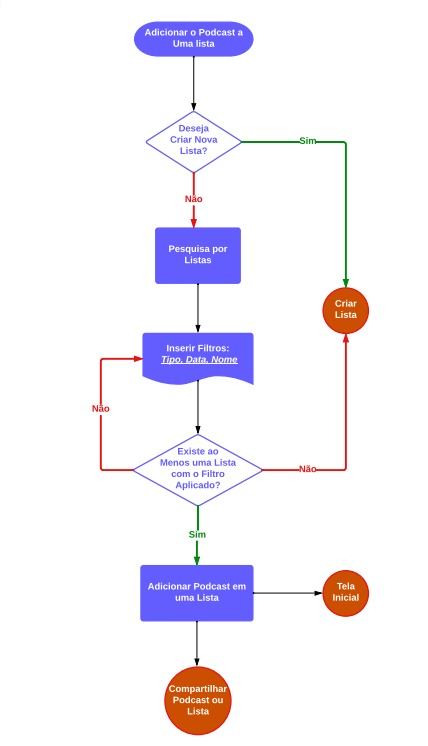
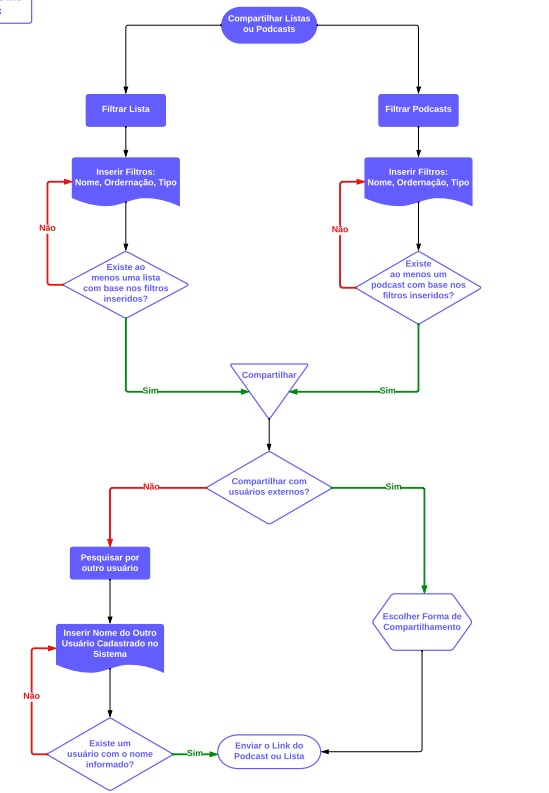
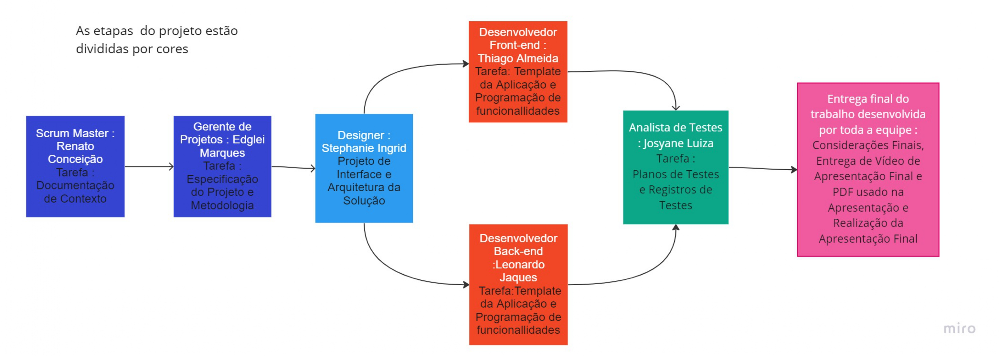

# Especificações do Projeto

Pré-requisitos: <a href="1-Documentação de Contexto.md"> Documentação de Contexto</a>

O ponto de partida para ranquear os podcasts mais ouvidos foi concretizado após sondagem e estudos realizados feitos pelos membros da equipe. 
Os detalhes levantados nesse processo foram consolidados na forma de personas e histórias de usuários.

## Personas

O ponto de partida para ranquear os podcasts mais ouvidos foi concretizado após sondagem e estudos realizados feitos pelos membros da equipe. 
Os detalhes levantados nesse processo foram consolidados na forma de personas e histórias de usuários.

TABELA DE PERSONAS

> **Links Úteis**:
> - [Rock Content](https://rockcontent.com/blog/personas/)
> - [Hotmart](https://blog.hotmart.com/pt-br/como-criar-persona-negocio/)
> - [O que é persona?](https://resultadosdigitais.com.br/blog/persona-o-que-e/)
> - [Persona x Público-alvo](https://flammo.com.br/blog/persona-e-publico-alvo-qual-a-diferenca/)
> - [Mapa de Empatia](https://resultadosdigitais.com.br/blog/mapa-da-empatia/)
> - [Mapa de Stalkeholders](https://www.racecomunicacao.com.br/blog/como-fazer-o-mapeamento-de-stakeholders/)
>
Lembre-se que você deve ser enumerar e descrever precisamente e personalizada todos os clientes ideais que sua solução almeja.

## Histórias de Usuários

Com base na análise das personas forma identificadas as seguintes histórias de usuários:

|EU COMO... `PERSONA`| QUERO/PRECISO ... `FUNCIONALIDADE` |PARA ... `MOTIVO/VALOR`                 |
|--------------------|------------------------------------|----------------------------------------|
|Usuário do sistema  | Registrar minhas tarefas           | Não esquecer de fazê-las               |
|Administrador       | Alterar permissões                 | Permitir que possam administrar contas |

Apresente aqui as histórias de usuário que são relevantes para o projeto de sua solução. As Histórias de Usuário consistem em uma ferramenta poderosa para a compreensão e elicitação dos requisitos funcionais e não funcionais da sua aplicação. Se possível, agrupe as histórias de usuário por contexto, para facilitar consultas recorrentes à essa parte do documento.

> **Links Úteis**:
> - [Histórias de usuários com exemplos e template](https://www.atlassian.com/br/agile/project-management/user-stories)
> - [Como escrever boas histórias de usuário (User Stories)](https://medium.com/vertice/como-escrever-boas-users-stories-hist%C3%B3rias-de-usu%C3%A1rios-b29c75043fac)
> - [User Stories: requisitos que humanos entendem](https://www.luiztools.com.br/post/user-stories-descricao-de-requisitos-que-humanos-entendem/)
> - [Histórias de Usuários: mais exemplos](https://www.reqview.com/doc/user-stories-example.html)
> - [9 Common User Story Mistakes](https://airfocus.com/blog/user-story-mistakes/)

## Modelagem do Processo de Negócio 

### Análise da Situação Atual

Atualmente muitos usuários de plataformas como o spotfy e o deezer sentem falta de um aplicativo específico para podcasts, mas além disso um aplicativo que permita esses usuário pesquisarem pelos podcasts que estão em alta, criar e compartilhar listas com seus podcasts favoritos etc

### Descrição Geral da Proposta

Propõe-se que sejá possível desenvolver um aplicativo móvel que permita os usuário pesquisar por podcasts específicos ou os que estão em alta na atualidade e compartilhar os podcasts que mais lhes interessa ou listas de podcasts.

### Processo 1 – Tela Inicial com Filtragem de Podcasts  

### Processo 2 – Login e Cadastro de Usuário

### Processo 3 – Favoritar e Desfavoritas Podcasts

### Processo 4 – Criação de Listas de Podcast

### Processo 5 – Filtragem e Pesquisa por Listas para Gerenciamento

### Processo 6 – Atualização de Dados da Lista

### Processo 7 – Adicionar Podcasts a uma Lista

### Processo 8 – Compartilhar Listas ou Podcasts

## Indicadores de Desempenho

Apresente aqui os principais indicadores de desempenho e algumas metas para o processo. Atenção: as informações necessárias para gerar os indicadores devem estar contempladas no diagrama de classe. Colocar no mínimo 5 indicadores. 

Usar o seguinte modelo: 

Obs.: todas as informações para gerar os indicadores devem estar no diagrama de classe a ser apresentado a posteriori. 

## Requisitos

O escopo funcional do projeto é definido por meio dos requisitos funcionais que descrevem as possibilidades interação dos usuários, bem como os requisitos não funcionais que descrevem os aspectos que o sistema deverá apresentar de maneira geral. Estes requisitos são apresentados a seguir.

### Requisitos Funcionais

A tabela a seguir apresenta os requisitos do projeto, identificando a prioridade em que os mesmos devem ser entregues.

|ID    | Descrição do Requisito  | Prioridade |
|------|-----------------------------------------|----|
|RF-001| O aplicativo deverá permitir que o usuário possa se cadastrar ou fazer login e desta forma tenha acesso às funcionalidades disponibilizadas.  | ALTA | 
|RF-002| O aplicativo deverá permitir que o usuário redefina sua senha caso o mesmo se esqueceça dela.   | Alta |
|RF-003| O aplicativo deve permitir o usuário compartilhar sua lista e podcasts favoritos com outros no whatsapp.   | Alta |
|RF-004| O aplicativo deverá permitir que o usuário pesquise por um podcast específico em um campo de busca na tela inicial.   | Alta |
|RF-005| O aplicativo deve permitir o usuário favoritar podcasts e automaticamente inseri-los em uma lista de podcasts favoritados pelo usuário.   | Alta |
|RF-006| Na tela inicial o usuário deverá ter acesso a uma thumbnail com os principais podcasts recomendados pelo sistema.   | Média |
|RF-007| O aplicativo deve permitir o usuário criar listas para armazenar determinados podcasts.   | Média |
|RF-008|O usuário deve ter a possibilidade de fazer a gestão de suas listas inserindo e removendo podcasts dessas listas ou até mesmo editando o nome da lista.    | Média |
|RF-009| O usuário deve poder criar e ordenar a descrição de uma de suas lista.  | Baixa |
|RF-010| O usuário deve poder ordenar suas listas ou filtrar pelo nome de uma lista específica.   | Baixa |
|RF-011| O aplicativo deve permitir que o usuário ordene os podcasts sugeridos por ele.   | Baixa |

### Requisitos não Funcionais

A tabela a seguir apresenta os requisitos não funcionais que o projeto deverá atender.

|ID     | Descrição do Requisito  |Prioridade |
|-------|-------------------------|----|
|RNF-001| O aplicativo deve ser publicado em um ambiente acessível publicamente. | Alta | 
|RNF-002| O aplicativo deverá ser responsivo permitindo a visualização em um celular de forma adequada |  Alta | 
|RNF-003| O aplicativo deve ser compatível com o sistema andriod |  Alta | 
|RNF-004| O aplicativo deve ter bom nível de contraste entre os elementos da tela em conformidade  |  Média | 
|RNF-005| O aplicativo deve ter um tema black para que deixe os usuários mais confortáveis durante o usuo. |  Média | 
|RNF-006| O aplicativo deve utilizar cores e ícones que sejam mais intuitivos para o usuário final. |  Média | 
|RNF-007| O aplicativo deve ser em português BR. |  BAIXA | 

Com base nas Histórias de Usuário, enumere os requisitos da sua solução. Classifique esses requisitos em dois grupos:

- [Requisitos Funcionais
 (RF)](https://pt.wikipedia.org/wiki/Requisito_funcional):
 correspondem a uma funcionalidade que deve estar presente na
  plataforma (ex: cadastro de usuário).
- [Requisitos Não Funcionais
  (RNF)](https://pt.wikipedia.org/wiki/Requisito_n%C3%A3o_funcional):
  correspondem a uma característica técnica, seja de usabilidade,
  desempenho, confiabilidade, segurança ou outro (ex: suporte a
  dispositivos iOS e Android).
Lembre-se que cada requisito deve corresponder à uma e somente uma
característica alvo da sua solução. Além disso, certifique-se de que
todos os aspectos capturados nas Histórias de Usuário foram cobertos.

## Restrições

As questões que limitam a execução desse projeto e que se configuram como obrigações claras para o desenvolvimento do projeto em questão são apresentadas na tabela a seguir.

|ID| Restrição                                             |
|--|-------------------------------------------------------|
|01| O projeto deverá ser entregue no final do semestre letivo, não podendo extrapolar a data de 07/07/2023. |
|02| A equipe deverá utilizar específicamente react native no front end.         |
|02| A equipe não poderá ter auxilios externos se de outros integrantes dela mesma para o desenvolvimento do projeto.     |

Enumere as restrições à sua solução. Lembre-se de que as restrições geralmente limitam a solução candidata.

> **Links Úteis**:
> - [O que são Requisitos Funcionais e Requisitos Não Funcionais?](https://codificar.com.br/requisitos-funcionais-nao-funcionais/)
> - [O que são requisitos funcionais e requisitos não funcionais?](https://analisederequisitos.com.br/requisitos-funcionais-e-requisitos-nao-funcionais-o-que-sao/)

## Diagrama de Casos de Uso

O diagrama de casos de uso é o próximo passo após a elicitação de requisitos, que utiliza um modelo gráfico e uma tabela com as descrições sucintas dos casos de uso e dos atores. Ele contempla a fronteira do sistema e o detalhamento dos requisitos funcionais com a indicação dos atores, casos de uso e seus relacionamentos. 

As referências abaixo irão auxiliá-lo na geração do artefato “Diagrama de Casos de Uso”.

> **Links Úteis**:
> - [Criando Casos de Uso](https://www.ibm.com/docs/pt-br/elm/6.0?topic=requirements-creating-use-cases)
> - [Como Criar Diagrama de Caso de Uso: Tutorial Passo a Passo](https://gitmind.com/pt/fazer-diagrama-de-caso-uso.html/)
> - [Lucidchart](https://www.lucidchart.com/)
> - [Astah](https://astah.net/)
> - [Diagrams](https://app.diagrams.net/)

# Matriz de Rastreabilidade

A matriz de rastreabilidade é uma ferramenta usada para facilitar a visualização dos relacionamento entre requisitos e outros artefatos ou objetos, permitindo a rastreabilidade entre os requisitos e os objetivos de negócio. 

A matriz deve contemplar todos os elementos relevantes que fazem parte do sistema, conforme a figura meramente ilustrativa apresentada a seguir.

> **Links Úteis**:
> - [Artigo Engenharia de Software 13 - Rastreabilidade](https://www.devmedia.com.br/artigo-engenharia-de-software-13-rastreabilidade/12822/)
> - [Verificação da rastreabilidade de requisitos usando a integração do IBM Rational RequisitePro e do IBM ClearQuest Test Manager](https://developer.ibm.com/br/tutorials/requirementstraceabilityverificationusingrrpandcctm/)
> - [IBM Engineering Lifecycle Optimization – Publishing](https://www.ibm.com/br-pt/products/engineering-lifecycle-optimization/publishing/)

# Gerenciamento de Projeto

De acordo com o PMBoK v6 as dez áreas que constituem os pilares para gerenciar projetos, e que caracterizam a multidisciplinaridade envolvida, são: Integração, Escopo, Cronograma (Tempo), Custos, Qualidade, Recursos, Comunicações, Riscos, Aquisições, Partes Interessadas. Para desenvolver projetos um profissional deve se preocupar em gerenciar todas essas dez áreas. Elas se complementam e se relacionam, de tal forma que não se deve apenas examinar uma área de forma estanque. É preciso considerar, por exemplo, que as áreas de Escopo, Cronograma e Custos estão muito relacionadas. Assim, se eu amplio o escopo de um projeto eu posso afetar seu cronograma e seus custos.

## Gerenciamento de Tempo
Os gráficos foram feitos baseado nas tarefas das etapas do projeto.

## Gerenciamento de Equipe
 

## Gestão de Orçamento

 O orçamento foi feito para os 5 meses de projeto com valores de forma fictícia , baseada nos seguintes link :

 <a href="https://www.treasy.com.br/blog/orcamento-de-rh/#:~:text=O%20Or%C3%A7amento%20de%20RH%2C%20tamb%C3%A9m,ter%C3%A1%20relacionados%20a%20seus%20funcion%C3%A1rios."> Recursos Humanos</a>.
 <a href="https://www.computerweekly.com/br/tip/Uma-analise-detalhada-dos-custos-de-hardware-de-servidor-para-PMEs"> Hardware</a>.
 <a href="https://www.findup.com.br/custos-que-devem-ser-considerados-ao-montar-um-setor-de-ti/"> Rede e Lincenças</a>.
 <a href="https://www.hsbs.com.br/como-o-custo-do-software-e-calculado/"> Software</a>.
 

